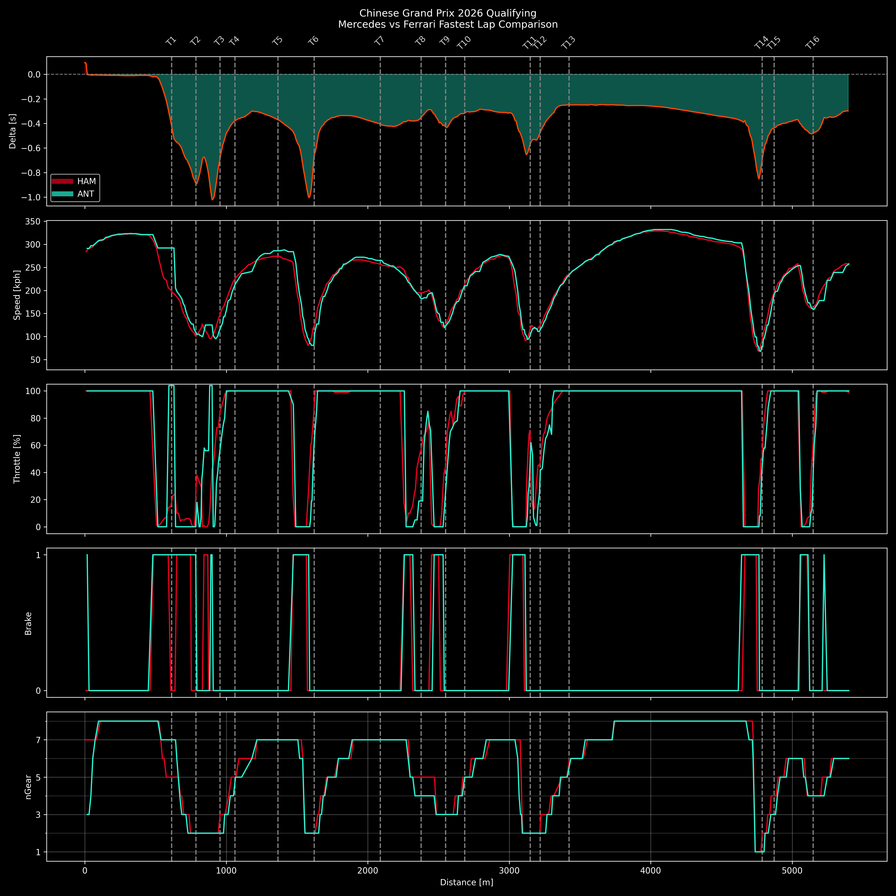

# F1 Telemetry Comparison Tool

This project analyzes and visualizes Formula 1 telemetry data using FastF1.

It compares two teams' fastest qualifying laps and highlights performance differences using speed, throttle, brake, gear, and delta time.

---

## 📊 Features

- Fastest lap extraction per team (Qualifying)
- Distance-based telemetry comparison
- Multi-layer visualization:
  - Delta time (time loss/gain)
  - Speed
  - Throttle
  - Brake
  - Gear
- Corner annotations with track map data
- Dark-mode visualization optimized for readability

---

## 📈 Example Output



---

## 🧠 Key Insight

The delta time plot clearly shows **where time is gained or lost** across the lap.

- Positive delta → Ferrari faster  
- Negative delta → Mercedes faster  

By combining delta with throttle and speed, you can identify:

- Braking efficiency differences
- Corner exit performance
- Possible energy deployment clipping (ERS behavior)

---

## 🛠️ Tech Stack

- Python
- FastF1
- Pandas / NumPy
- Matplotlib

---

## ⚙️ How It Works

1. Load qualifying session data
2. Extract fastest lap per team
3. Convert telemetry to distance-based data
4. Interpolate both laps onto a common distance axis
5. Compute delta time
6. Visualize all telemetry channels

---

## ▶️ Usage

```bash
pip install fastf1 matplotlib pandas numpy
